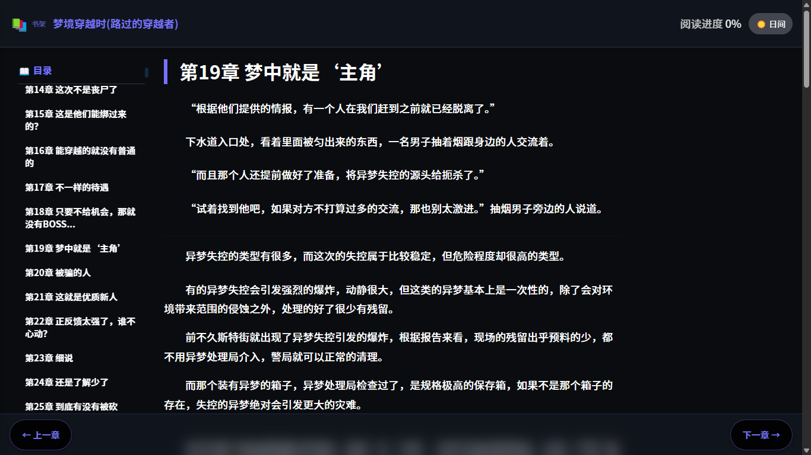
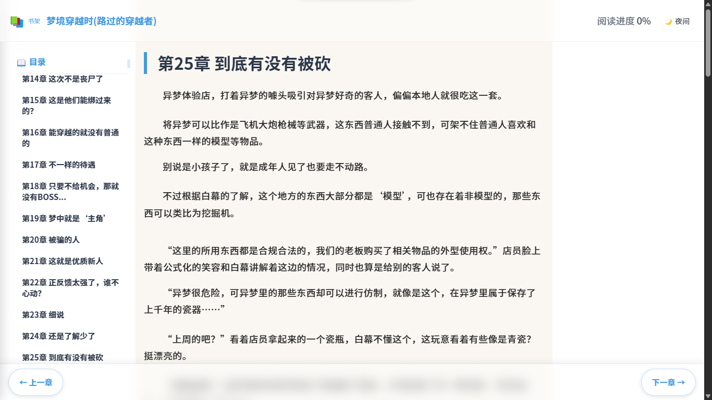
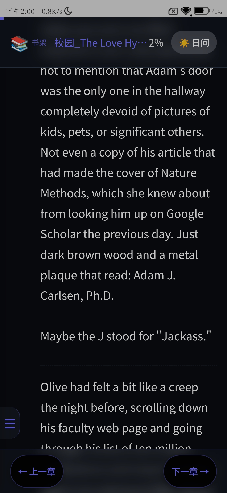

# EPUB2HTML Tool / EPUB转HTML工具

[](https://github.com/luckyme258/epub2html-tool/releases)
[](https://github.com/luckyme258/epub2html-tool/releases)
[](https://github.com/luckyme258/epub2html-tool/releases)
[](https://creativecommons.org/licenses/by-nc/4.0/)

## 📖 Introduction / 简介

**English**  
EPUB2HTML Tool is a GUI application that converts EPUB eBooks to well-structured HTML files, making them easy to read and share in browsers.  
Currently supports Windows (EXE), with Linux (DEB) version coming soon.

**中文**  
EPUB转HTML工具是一款图形化应用程序，能够将EPUB电子书转换为结构清晰的HTML文件，方便在浏览器中阅读和分享。  
目前支持Windows版本（EXE），Linux版本（DEB）即将推出。

---

## ✨ Features / 功能特性

| English | 中文 |
|---------|------|
| ✅ **Graphical User Interface** - No command line needed | ✅ **图形化界面** - 无需记忆命令 |
| ✅ **Smart Parsing** - Automatically extract table of contents | ✅ **智能解析** - 自动提取目录结构 |
| ✅ **Text Optimization** - Fix English contractions and punctuation | ✅ **文本优化** - 智能修复英文缩写和标点 |
| ✅ **Tool Extraction** - Identify and extract tool modules | ✅ **工具提取** - 自动识别并提取工具模块 |
| ✅ **Chapter Summary** - Extract "Chapter Summary" sections | ✅ **章节小结** - 自动提取“本章小结”内容 |
| ✅ **Theme Switching** - Day/Night mode support | ✅ **主题切换** - 支持日间/夜间模式 |
| ✅ **Mobile Friendly** - Responsive HTML output | ✅ **移动端适配** - 生成的HTML支持手机浏览 |
| ✅ **Reading Progress** - Real-time progress indicator | ✅ **阅读进度** - 实时显示阅读进度 |
| ✅ **Bilingual Parsing** - Supports standard EPUB e-books in both Chinese and English | ✅ **双语解析** - 支持中英文标准 EPUB 电子书 |
| ⚠️ **Compatibility Note** - Non-standard EPUB files may fail to parse. If you encounter problems, please try other EPUB versions of the book | ⚠️ **兼容说明** - 非标准 EPUB 可能解析失败。如遇问题，请尝试更换该书的其它 EPUB 版本 |

---

## 🖼️ Screenshots / 截图

### 📦 Two Separate Versions / 两个独立版本

This tool provides **English version** and **Chinese version** as two separate executables. Below are screenshots showing both versions' interfaces and features.
本工具提供**英文版**和**中文版**两个独立版本，以下截图展示两个版本的界面和功能。

---

#### 🇬🇧 English Version (epub2html_Eng.exe)

| | |
|:---:|:---:|
| **☀️ Day Mode / 日间模式** | **🌙 Night Mode / 夜间模式** |
|  | *Coming Soon / 即将添加* |
| *English version main interface (Day mode)* | *English version night mode* |
| *英文版本主界面（日间模式）* | *英文版本夜间模式* |

---

#### 🇨🇳 Chinese Version (epub2html_CN.exe)

| | |
|:---:|:---:|
| **☀️ Day Mode / 日间模式** | **🌙 Night Mode / 夜间模式** |
|  |  |
| *Chinese version main interface (Day mode)* | *Chinese version night mode* |
| *中文版本主界面（日间模式）* | *中文版本夜间模式* |

| | |
|:---:|:---:|
| **🖥️ Chinese UI Detail / 中文界面特写** |
|  |
| *Chinese version interface close-up (Day mode)* |
| *中文版本界面特写（日间模式）* |

---

### 📱 Mobile HTML Output / 移动端HTML输出

The generated HTML files are responsive and work perfectly on mobile devices, with both day/night themes.
生成的HTML文件支持响应式设计，完美适配移动设备，并支持日间/夜间主题切换。

| | |
|:---:|:---:|
| **☀️ Day Mode / 日间模式** | **🌙 Night Mode / 夜间模式** |
|  |  |
| *Mobile view - Day mode* | *Mobile view - Night mode* |
| *移动端日间模式浏览效果* | *移动端夜间模式浏览效果* |

---

### 📋 Screenshot Inventory / 截图清单

| # | Filename / 文件名 | Content / 内容 | Version / 版本 |
|:-:|:---|:---|:---:|
| 1 | `English UI-英文界面.png` | English version main interface (Day mode) / 英文版主界面（日间模式） | 🇬🇧 English |
| 2 | `Chinese UI-中文界面.png` | Chinese version main interface (Day mode) / 中文版主界面（日间模式） | 🇨🇳 Chinese |
| 3 | `PC-CN-DayMode.png` | Chinese version interface close-up (Day mode) / 中文版界面特写（日间模式） | 🇨🇳 Chinese |
| 4 | `PC-CN-NightMode.png` | Chinese version night mode / 中文版夜间模式 | 🇨🇳 Chinese |
| 5 | `Mobile-Eng-DayMode.jpg` | Mobile output - Day mode / 移动端输出 - 日间模式 | 📱 Mobile |
| 6 | `Mobile-Eng-NightMode.jpg` | Mobile output - Night mode / 移动端输出 - 夜间模式 | 📱 Mobile |

---

## 🚀 Download & Installation / 下载安装

### 🪟 Windows

**English**  
1. Download the appropriate version from [Releases](https://github.com/luckyme258/epub2html-tool/releases):  
   - `epub2html_Eng.exe` for English interface  
   - `epub2html_CN.exe` for Chinese interface  
2. Double-click to run (no installation required)  
3. Click "Browse" to select an EPUB file  
4. Click "Start Conversion"  
5. The generated HTML file will open automatically in your default browser

**中文**  
1. 从 [Releases](https://github.com/luckyme258/epub2html-tool/releases) 页面下载对应版本：  
   - 英文界面请下载 `epub2html_Eng.exe`  
   - 中文界面请下载 `epub2html_CN.exe`  
2. 双击运行（无需安装）  
3. 点击"浏览"选择EPUB文件  
4. 点击"开始转换"  
5. 生成的HTML文件将自动在默认浏览器中打开

### 🐧 Linux (Coming Soon / 即将推出)

**English**  
- DEB package for Debian/Ubuntu-based distributions will be available in future releases  
- Installation: `sudo dpkg -i epub2html-tool.deb`  
- Stay tuned for updates!

**中文**  
- 适用于Debian/Ubuntu等发行版的DEB包将在后续版本中提供  
- 安装命令：`sudo dpkg -i epub2html-tool.deb`  
- 敬请期待！

---

## ⚙️ Version Selection Guide / 版本选择指南

| | English Version / 英文版 | Chinese Version / 中文版 |
|:---|:---:|:---:|
| **Executable / 执行文件** | `epub2html_Eng.exe` | `epub2html_CN.exe` |
| **Interface Language / 界面语言** | 🇬🇧 English | 🇨🇳 中文 |
| **Target Users / 目标用户** | International users | Chinese users |
| **Screenshot / 截图** |  |  |
| **Functionality / 功能** | ✅ Identical / 完全相同 | ✅ Identical / 完全相同 |

> **💡 Note / 说明**: Both versions have the same functionality - only the interface language differs. The generated HTML files support both English and Chinese content.
> **💡 说明**：两个版本功能完全相同，仅界面语言不同。生成的HTML文件均支持中英文内容。

---

## 📁 File Structure / 文件结构

```
epub2html-tool/
├── 📦 Windows Version / Windows版本
│   ├── epub2html_Eng.exe          # English version / 英文版
│   └── epub2html_CN.exe           # Chinese version / 中文版
├── 📦 Linux Version / Linux版本 (Coming Soon / 即将推出)
│   └── epub2html-tool.deb          # DEB package / DEB包
├── 📸 Screenshots / 截图
│   ├── English UI-英文界面.png      # English version screenshot
│   ├── Chinese UI-中文界面.png      # Chinese version main interface
│   ├── PC-CN-DayMode.png           # Chinese version day mode close-up
│   ├── PC-CN-NightMode.png         # Chinese version night mode
│   ├── Mobile-Eng-DayMode.jpg      # Mobile output day mode
│   └── Mobile-Eng-NightMode.jpg    # Mobile output night mode
└── README.md                        # Documentation / 文档
```

---

## ⚠️ Notes / 注意事项

### 🪟 Windows Users / Windows用户

**English**  
- **First run**: Windows Defender may show a warning. Click "More info" → "Run anyway" (this is normal for unsigned applications)  
- **Placement**: It's recommended to put the EXE in a separate folder  
- **Output**: Generated HTML files will be saved in your Downloads folder by default (configurable in the UI)  
- **Portable**: No installation required, just download and run  
- **Two versions**: Choose the version that matches your preferred language

**中文**  
- **首次运行**：Windows Defender 可能会显示警告，点击“更多信息”→“仍要运行”（这是未签名应用的正常现象）  
- **存放位置**：建议将EXE文件放在单独的文件夹中运行  
- **输出位置**：生成的HTML文件默认保存在下载文件夹（可在界面中修改）  
- **便携式**：无需安装，下载即用  
- **两个版本**：根据您偏好的界面语言选择合适的版本

### 🐧 Linux Users / Linux用户 (Coming Soon / 即将推出)

**English**  
- DEB package will be available for Debian/Ubuntu and derivatives  
- Installation: `sudo dpkg -i epub2html-tool.deb`  
- More details will be provided in future releases  

**中文**  
- DEB包将支持Debian/Ubuntu及其衍生发行版  
- 安装命令：`sudo dpkg -i epub2html-tool.deb`  
- 更多细节将在后续版本中提供  

---

## ❓ FAQ / 常见问题

**Q: Why does Windows Defender show a warning? / 为什么Windows Defender显示警告？**  
A: The EXE is not digitally signed (which costs money). It's completely safe, just click "Run anyway".  
A: 由于EXE没有数字签名（签名需要付费），这是正常现象，点击“仍要运行”即可。

**Q: Where are the generated HTML files saved? / 生成的HTML文件保存在哪里？**  
A: By default in your Downloads folder. You can change this in the UI before conversion.  
A: 默认保存在下载文件夹，你可以在转换前在界面中修改输出目录。

**Q: Does this require Python installation? / 需要安装Python吗？**  
A: No, the EXE is standalone and includes everything needed.  
A: 不需要，EXE是独立的，包含所有必要组件。

**Q: When will the Linux version be available? / Linux版本什么时候发布？**  
A: Linux (DEB) version is planned for future releases. Watch this repository for updates!  
A: Linux版本（DEB）计划在后续版本中发布，请关注本仓库的更新！

**Q: Can I use this for commercial purposes? / 可以用于商业用途吗？**  
A: No, this tool is free for personal use only. Commercial use is not permitted.  
A: 不可以，本工具仅限个人免费使用，禁止商业用途。

**Q: Does it support both Chinese and English eBooks? / 支持中英文书籍吗？**  
A: Yes, the tool supports both Chinese and English eBooks. It automatically detects the language and applies appropriate text optimization.  
A: 是的，本工具支持中英文书籍，会自动检测语言并应用相应的文本优化。

**Q: What if my EPUB is not standard format? / 如果我的EPUB不是标准格式怎么办？**  
A: This tool is developed and tested for **standard EPUB format** only. Non-standard EPUBs (with irregular structure, missing TOC, or proprietary formatting) may fail to extract content properly. For best results, please use standard EPUB files.  
A: 本工具仅针对**标准EPUB格式**进行开发和测试。非标准EPUB（如结构不规范、缺少目录、或使用专有格式）可能会出现提取内容失败的情况。为获得最佳效果，请使用标准EPUB文件。

**Q: What's the difference between the two EXE files? / 两个EXE文件有什么区别？**  
A: `epub2html_Eng.exe` has English interface, `epub2html_CN.exe` has Chinese interface. Both have identical functionality.  
A: `epub2html_Eng.exe`是英文界面，`epub2html_CN.exe`是中文界面，两个版本功能完全相同。

**Q: Why is the English version missing a night mode screenshot? / 为什么英文版缺少夜间模式截图？**  
A: The English version's night mode interface is identical in layout to the Chinese version shown above, only with English text. We'll add it in a future update.  
A: 英文版的夜间模式界面布局与上图中文版完全相同，只是文字为英文。我们将在后续更新中添加截图。

---

## 📅 Roadmap / 开发计划

- [✔] Windows EXE version - English / Windows EXE版本 - 英文版
- [✔] Windows EXE version - Chinese / Windows EXE版本 - 中文版
- [✔] Day/Night theme switching / 日间/夜间主题切换
- [ ] English version night mode screenshot / 英文版夜间模式截图
- [ ] Linux DEB package / Linux DEB包
- [ ] macOS version (planned) / macOS版本（计划中）

---

## 📄 License / 许可协议

This work is licensed under a **Creative Commons Attribution-NonCommercial 4.0 International License**.

**English**  
- ✅ Free for personal use  
- ✅ You may share and adapt the material  
- ❌ Commercial use is strictly prohibited  
- ❌ You must give appropriate credit  

**中文**  
- ✅ 允许个人免费使用  
- ✅ 允许分享和修改（非商业用途）  
- ❌ 严禁商业用途  
- ❌ 使用时必须保留原作者信息  

[](https://creativecommons.org/licenses/by-nc/4.0/)

---

## 📧 Contact / 联系方式

- Author / 作者：luckyme258
- GitHub：[@luckyme258](https://github.com/luckyme258)
- Issues：[Report a problem / 报告问题](https://github.com/luckyme258/epub2html-tool/issues)

---

## ⭐ Support / 支持项目

**English**  
If this tool helps you, please Star⭐!  
Your support encourages me to keep improving this tool.

**中文**  
如果这个工具对你有帮助，欢迎Star⭐！  
你的支持是我持续改进的动力。

---

**Thank you for using EPUB2HTML Tool! / 感谢使用EPUB转HTML工具！**
```

